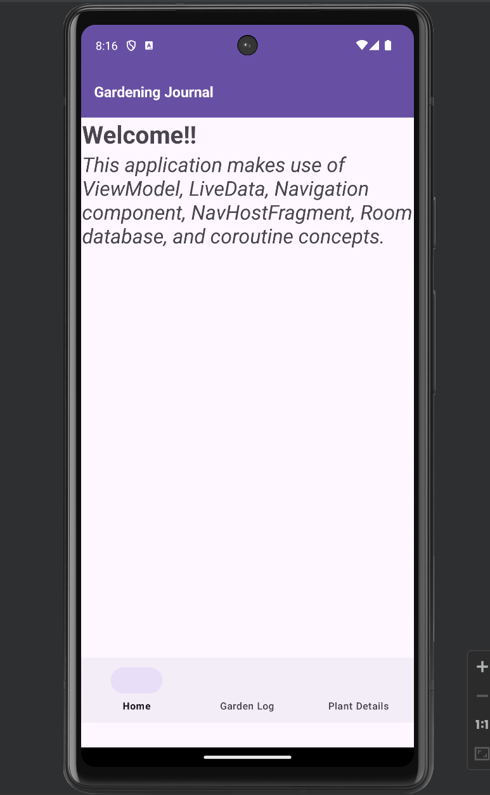

# Gardening Journal App

Brief description or introduction to your project.

## Table of Contents

- [Description](#description)
- [Installation & Running](#installation-And-running)
- [Screenshots](#screenshots)

## Description

Gardening Journal App is a project developed as part of the submission for `CS473DE: Mobile Device Programming` course. This application supports android devices starting Android 7.0 (API level 24) to the latest Android 14 (API Level 34).

This application makes use of ViewModel, LiveData, Navigation component, NavHostFragment, Room database, and coroutine concepts to add and display plant data as a gardening log. The data is stored and retrieved with the help of Room Database and displayed using a recyclerView.

## Installation And Running

- Clone the project
- Open it in your local IDE (Android Studio, IntelliJ)
- Install the dependencies and run the project using your android emulator or connected device.

## Screenshots

Some of the screens of the application are:

### Home

### Garden Log

### Add Garden Log

### Plant Details

